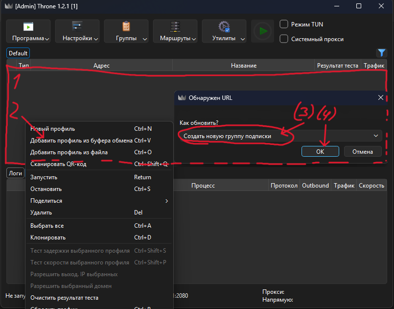
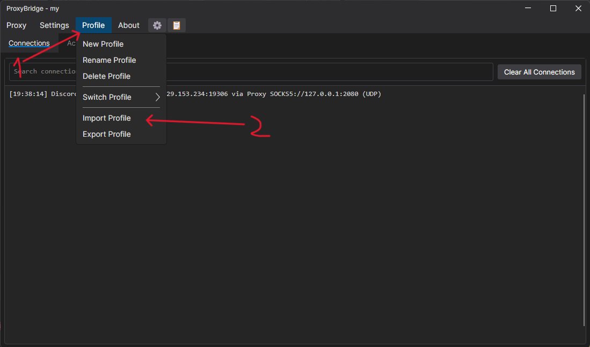
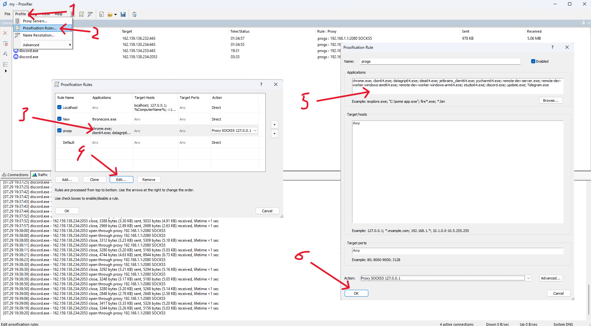
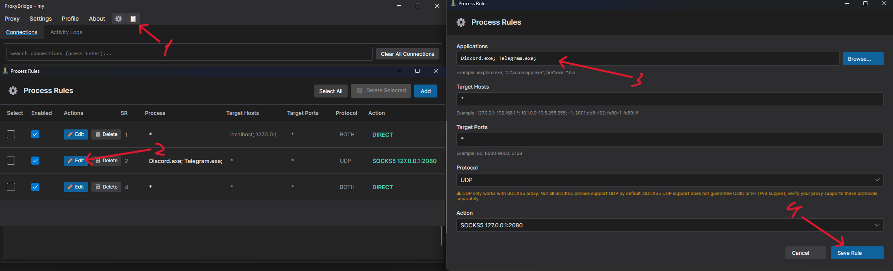

# 🚀 Маршрутизируемый VPN-комплект для Windows

Сборка заточена под постоянное использование VPN без потери скорости. Она направляет через VPN **только те сервисы, которые вы укажете сами**, оставляя весь остальной трафик не тронутым.

---

## 📦 Что внутри?

* 🔹 **[Throne](https://github.com/throneproj/Throne/releases)** — современный и гибкий VPN-клиент с широким функционалом.
* 🔹 **[Proxifier](https://www.proxifier.com/)** — проверенный временем прокси-клиент для захвата TCP-трафика.
* 🔹 **[ProxyBridge](https://github.com/InterceptSuite/ProxyBridge/releases)** — продвинутый прокси-клиент с полной поддержкой как TCP, так и UDP-трафика.

---

## 💡 Почему стоит использовать именно эту сборку?

У большинства пользователей уже есть готовая подписка на VPN (VLESS, Amnezia WG и подобные). В таком случае нет смысла переплачивать за узкоспециализированные сервисы (вроде GearUP) или связываться с утилитами вроде Zapret.

**Главные плюсы:**
* 🎯 **Точечная работа:** Сборка из коробки настроена на самые популярные сервисы (Discord, Telegram, браузеры).
* ⚡ **Без лагов в играх:** Игровой трафик идет напрямую через вашего провайдера и никак не затрагивается утилитами.
* 🛠️ **Гибкость:** Любое нестандартное приложение добавляется в правила за пару кликов.

---

## 🛠️ Инструкция по установке

1. Скачайте архив со сборкой и распакуйте его в удобную папку.
2. Запустите **Throne** (по пути `...\Throne\Throne.exe`) и добавьте в него ваш VPN-профиль/ключ.
3. Выберите сервер и нажмите плей (большая кнопка с зеленым треугольником)
4. Запустите **Proxifier** (по пути `...\Proxifier PE\Proxifier.exe`).
5. Установите **ProxyBridge** (по пути `...\ProxyBridge\ProxyBridge-Setup-4.0.0.exe`).
6. Импортируйте готовый профиль из той же папки в ProxyBridge.
7. Готово! Пользуйтесь интернетом без ограничений.

📸 <b>Нажми, чтобы открыть пошаговые скриншоты установки</b>

 

| Шаг 2: Throne | Шаг 6: ProxyBridge |
| :---: | :---: |
|  |  |

---

## ➕ Как добавить свое приложение в правила?

Если у вас есть игра или программа, требующая VPN:

### 1️⃣ Обычные приложения и игры (TCP)
1. Откройте **Proxifier**.
2. Перейдите во вкладку **Profile** -> **Proxification Rules**.
3. Дважды кликните по правилу `programs` и допишите название вашего `.exe` файла через `;` в поле **Applications**.
4. Нажмите **OK**.

### 2️⃣ Если в игре или программе есть голосовой чат (UDP)
1. Откройте **ProxyBridge**.
2. Перейдите во вкладку **Proxy** -> **Proxy Rules**.
3. Нажмите кнопку **Edit** во 2-м правиле и допишите `.exe` файл через `;` в поле **Applications**.
4. Нажмите **Save Rule**.

📸 <b>Нажми, чтобы открыть скриншоты добавления программ</b>

 

| Настройка Proxifier (TCP) | Настройка ProxyBridge (UDP) |
| :---: | :---: |
|  |  |

---

## ❓ FAQ (Часто задаваемые вопросы)

<b>1. Зачем нужны 2 прокси-клиента, если ProxyBridge поддерживает оба протокола?</b>

Проблема ProxyBridge в том, что он не очень хорошо справляется с большим количеством одновременных соединений по сравнению с Proxifier. Поэтому основная нагрузка (TCP-трафик) ложится на выносливый Proxifier, а редкий и тяжелый UDP-трафик берёт на себя ProxyBridge.

<b>2. Что делать, если нужный сайт не открывается через VPN?</b>

1. Откройте **Throne**.
2. Перейдите во вкладку **Маршруты** -> **Настройки Маршрутизации**.
3. Дважды кликните по профилю с именем **1** и перейдите на вкладку **Дополнительно**.
4. В панели настройки правил перейдите на вкладку **domain_keyword** и допишите недостающие домены или ключевые слова (каждое с новой строки).
5. Нажмите **ОК** -> **ОК**.

| Настройка Throne |
| :---: |
|  |

